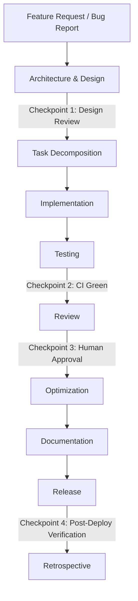

# AI_WORKFLOW.md — The Valor SMP

The complete autonomous software development lifecycle for this repository, with explicit checkpoints where a human (or a designated review agent) must sign off before proceeding.

---

## Stage 1 — Feature Request / Bug Report Intake

**Input:** a ticket in `TICKETS.md` format, a GitHub issue, or a direct instruction.

**Agent actions:**
- Read the ticket in full. Read linked `docs/*.md` pages.
- Confirm the ticket has: a clear problem statement, acceptance criteria, and (for features) a rough sense of priority/`ROADMAP.md` alignment.
- If any of the above is missing and cannot be conservatively inferred, request clarification per `AGENTS.md` §11.

**Output:** confirmed understanding, restated in the agent's own words as the first line of its design note.

---

## Stage 2 — Architecture & Design

**Agent actions:**
- Identify affected layers: which services, repositories, models, events, config keys, commands.
- Check for reuse: does an existing service already do 80% of this?
- Sketch data model changes, including migration direction (see `DATABASE.md`).
- Identify the worst-case failure mode (see `AGENTS.md` §12, Risk Management) for anything touching money, permissions, or persistent data.
- Write the design note (can be the PR description if the change is small).

**✅ Checkpoint 1 — Design Review**
For anything introducing a new service, a new table, or a new permission node: a human (or designated senior-review agent) reviews the design note *before* implementation begins. Small, well-precedented changes (e.g., adding a new quest of an existing quest type) can skip this checkpoint — use judgment per `AGENTS.md` §11.

---

## Stage 3 — Task Decomposition

**Agent actions:**
- Break the design into commits/PRs sized per `AGENTS.md` §7.
- Order the work: models → repository (+ in-memory fake) → service (+ unit tests) → listener/command (+ integration tests) → config → docs.
- If decomposing into multiple PRs, note the dependency order explicitly (PR 2 depends on PR 1 merging first).

---

## Stage 4 — Implementation

**Agent actions:**
- Follow `CODING_STANDARDS.md` and `ARCHITECTURE.md` strictly.
- Implement in the layer order from Stage 3, committing at each coherent step (see commit conventions, `AGENTS.md` §10).
- Keep the working tree buildable at every commit where feasible (`./gradlew compileJava` should not break mid-sequence).

---

## Stage 5 — Testing

**Agent actions:**
- Unit test all new/changed service logic (happy path, edge case, failure case) per `TESTING.md`.
- Integration test all new/changed listener/command wiring with MockBukkit.
- For bug fixes: write the regression test first, confirm it fails against the pre-fix code, then fix, then confirm it passes.
- Run `./gradlew check` locally (or in the agent's sandboxed environment) before proceeding.

**✅ Checkpoint 2 — CI Green**
The CI pipeline (`DEVOPS.md`) must pass: compile, unit tests, integration tests, static analysis, dependency license scan. No PR proceeds to review with red CI, except to explicitly ask for help diagnosing a CI-only failure.

---

## Stage 6 — Review

**Agent actions:**
- Open the PR following the template in `REVIEW.md` / `AGENTS.md` §10.
- Run the self-review checklist (`AGENTS.md` §14) and check every box honestly before requesting review.
- Respond to review feedback promptly; do not silently ignore comments; do not scope-creep in response to suggestions (spin those into new tickets).

**✅ Checkpoint 3 — Human Approval**
At least one human maintainer approves before merge, for all changes. (An agent may be delegated approval authority for narrowly-scoped, low-risk, well-precedented change classes if `DECISIONS.md` explicitly grants it — absent such a grant, assume human approval is required.)

---

## Stage 7 — Optimization

**Agent actions (post-functional-correctness, pre- or post-merge depending on urgency):**
- Profile if the change touches a hot path (combat resolution, per-tick listeners, frequently-run commands) per `PERFORMANCE.md`.
- Look for N+1 repository calls, unnecessary synchronous I/O on the main thread, or unbounded in-memory growth (e.g., a cache with no eviction).
- Optimization should not compromise readability without a documented reason (a comment explaining the non-obvious optimization and why it's needed).

---

## Stage 8 — Documentation

**Agent actions:**
- Update the relevant `docs/<feature>.md` page to reflect actual shipped behavior (not the original design note, if it changed during implementation).
- Update `CONFIGURATION.md`-referenced default config files/comments for any new keys.
- Update `API.md` if public plugin-to-plugin API surface changed.
- Add a `DECISIONS.md` entry if a nontrivial architectural or product choice was made along the way that isn't already documented.

---

## Stage 9 — Release

**Agent actions:**
- Follow `RELEASE.md` for versioning (SemVer) and changelog entry format.
- Confirm migrations are included and tested against a copy of representative existing data where the change touches schema (`DATABASE.md`).

**✅ Checkpoint 4 — Post-Deploy Verification**
After deployment to the live server (per `DEVOPS.md`'s release pipeline), verify: server starts cleanly, no new errors in logs on startup, the specific new/changed feature works as expected in a smoke test. If verification fails, follow the rollback strategy in `DEVOPS.md` immediately rather than attempting a hotfix under pressure.

---

## Stage 10 — Retrospective

**Agent actions:**
- For any change that required an escalation (`AGENTS.md` §13), required a rollback, or took significantly longer than estimated: write a short retrospective note. What made this hard? Should `ARCHITECTURE.md`, `AGENTS.md`, or a `docs/*.md` page be updated to prevent the same friction next time?
- File any follow-up tickets uncovered during the work (`TICKETS.md` format) rather than letting them evaporate.

---

## Checkpoint Summary Table

| Checkpoint | Gate | Who |
|---|---|---|
| 1. Design Review | Nontrivial designs reviewed before implementation | Human / senior-review agent |
| 2. CI Green | All automated checks pass | CI pipeline |
| 3. Human Approval | PR approved before merge | Human maintainer |
| 4. Post-Deploy Verification | Live smoke test passes post-release | Agent + human on-call |
