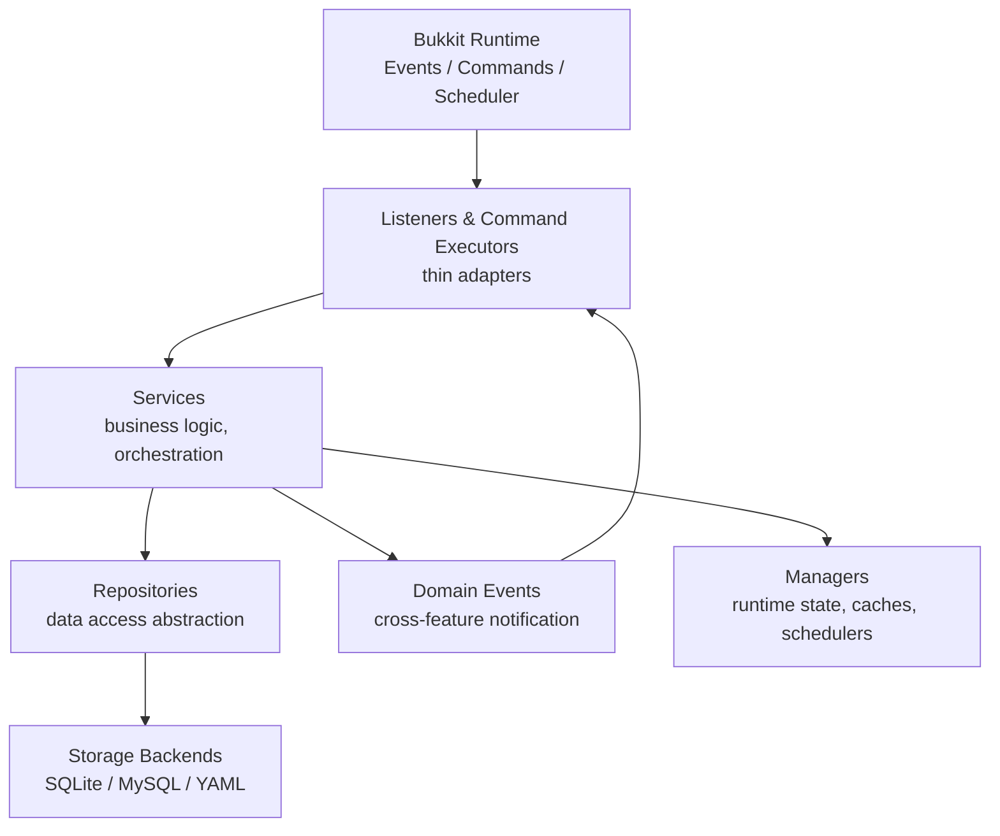
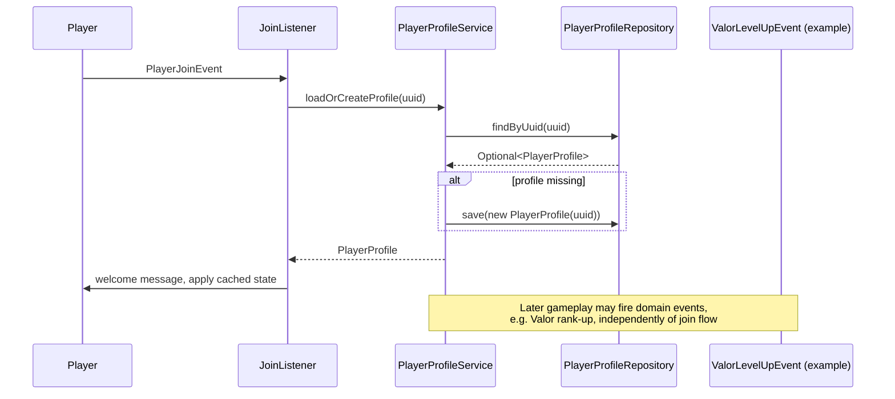
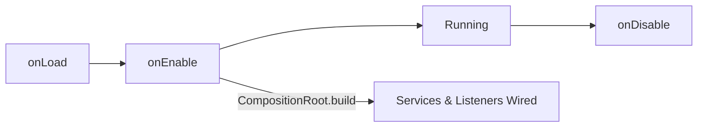
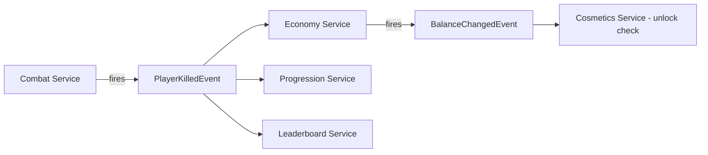

# ARCHITECTURE.md — The Valor SMP

This document is the authoritative description of system architecture. Any structural decision not covered here should be proposed as a `DECISIONS.md` entry, not improvised.

---

## 1. Architectural Style

The Valor SMP uses a **layered, service-oriented, repository-pattern architecture** with **constructor-based dependency injection** and **event-driven** cross-feature communication.

Goals this architecture serves:

- **Testability**: business logic is separable from the Bukkit runtime.
- **Replaceability**: storage backends, and even entire services, can be swapped via interfaces.
- **Low coupling between features**: Combat doesn't call Economy directly; it publishes an event, and Economy decides whether to react.
- **Predictable dependency direction**: no cycles, no "just reach into the manager from anywhere" shortcuts.

---

## 2. Layers



### 2.1 Listeners & Command Executors

- Implement `org.bukkit.event.Listener` or Paper's `Command`/Brigadier-based executor.
- Responsibilities: parse Bukkit-native input (events, command args), call exactly one (or a small, clearly composed set of) service method(s), translate the result into player-facing feedback (messages, sounds, particles).
- **Must not** contain conditionals that encode business rules (e.g., "can this player claim this land" belongs in `LandClaimService`, not in the listener).
- **Must** be cheap and fast; anything expensive is delegated to a service, which may itself delegate to an async-safe repository call.

### 2.2 Services

- Plain Java classes (no Bukkit `Listener` inheritance), injected with the repository interfaces and other service interfaces they depend on.
- Own business rules, validation, and orchestration across repositories.
- Should be unit-testable with zero Bukkit runtime present, wherever the logic doesn't intrinsically require Bukkit types (e.g., an `ItemStack`). Where Bukkit types are unavoidable (inventory manipulation), isolate that portion and keep decision logic Bukkit-free.
- Publish domain events (see `EVENTS.md`) rather than calling other services directly when the relationship is "feature B reacts to feature A", to keep features decoupled.
- May call other services directly when the relationship is a genuine, tight, intentional dependency (e.g., `LandClaimService` calling `PermissionService` to check a flag) — this is a deliberate composition, not decoupled notification, and should be documented as such in Javadoc.

### 2.3 Repositories

- Interface + implementation pair per aggregate (e.g., `LandClaimRepository` / `SqlLandClaimRepository`).
- Own all persistence concerns: SQL, caching of reads, mapping between database rows and domain models.
- Never contain business rules — only data shape and query logic.
- Every repository interface has an in-memory test implementation (`InMemoryLandClaimRepository`) used in unit tests, so service tests never touch a real database.

### 2.4 Managers

- Coordinate **runtime state** that isn't naturally "a repository of persisted data" — e.g., active combat tags with expiry timers, an in-memory leaderboard cache refreshed on a schedule, currently-open GUI sessions.
- Managers may hold Bukkit scheduler tasks. Services generally should not schedule tasks directly; they ask a manager to do so, or return data that a listener/manager uses to schedule.

### 2.5 Utilities

- Pure, static, stateless helper functions (formatting, math, string manipulation). No Bukkit dependency preferred; if unavoidable, keep Bukkit-dependent utilities in a clearly separate package (`util.bukkit` vs `util.core`).

### 2.6 Configuration

- Strongly typed config model classes in `config/`, deserialized from YAML (see `CONFIGURATION.md`).
- Services receive config objects via constructor injection, never read `plugin.getConfig()` directly.

### 2.7 Events (Domain Events)

- Custom classes extending `org.bukkit.event.Event`, living in `events/`, representing **domain-level occurrences** ("a player leveled up their Valor rank"), distinct from raw Bukkit events ("a player broke a block").
- Services fire domain events through Bukkit's `PluginManager` so that any feature (including future ones) can listen without the firing service knowing who's listening.
- Full catalogue and conventions in `EVENTS.md`.

---

## 3. Dependency Injection

The Valor SMP uses a lightweight, explicit DI approach (constructor injection wired by hand in a central `core/CompositionRoot.java`), not a heavyweight framework like Spring — Bukkit plugin lifecycles don't map cleanly onto Spring's container lifecycle, and the added complexity isn't justified at this project's scale.

```java
public final class CompositionRoot {

    private final ValorPlugin plugin;

    public CompositionRoot(ValorPlugin plugin) {
        this.plugin = plugin;
    }

    public ServiceRegistry build() {
        // Repositories
        LandClaimRepository landClaimRepository =
            new SqlLandClaimRepository(plugin.getDataSource());

        // Services
        LandClaimService landClaimService =
            new LandClaimService(landClaimRepository, plugin.getConfigService().landClaims());

        // Listeners (registered, not stored beyond registration)
        plugin.getServer().getPluginManager()
            .registerEvents(new LandClaimListener(landClaimService), plugin);

        return new ServiceRegistry(landClaimService /*, ... */);
    }
}
```

Rules:

- Every service constructor takes interfaces, never concrete repository/service classes.
- `CompositionRoot` is the **only** place `new SqlXRepository(...)` appears for production wiring. Tests construct their own graphs with in-memory fakes.
- No service reaches back into `ValorPlugin` for "just one more thing" — if a service needs something, it's an explicit constructor parameter.

---

## 4. Dependency Flow Rules

Allowed:
```
Listener/Command → Service → Repository → Storage
Service → Manager
Service → other Service (documented, intentional)
Service → Domain Event → (any) Listener
```

Forbidden:
```
Repository → Service           (repositories never call up)
Service → Listener/Command     (services never call adapters)
Listener → Repository          (skip the service layer)
Model → Service/Repository     (models are data, not behavior owners)
```

---

## 5. Player Lifecycle



- On join: load-or-create the player's profile asynchronously where the repository supports it, apply to the player synchronously once loaded (Bukkit API calls affecting the player must be on the main thread).
- On quit: services flush any dirty in-memory state to repositories; managers clear ephemeral session state (open GUIs, combat tags past their timer, etc., though combat tags should persist across a quick relog per `docs/combat.md`).

---

## 6. Plugin Lifecycle



- `onLoad`: register any custom recipe/world-gen hooks that must exist before other plugins load. Avoid heavy work here.
- `onEnable`: initialize data source/connection pool, run pending migrations (see `DATABASE.md`), build the `CompositionRoot`, register listeners and commands, start scheduled tasks via managers.
- `onDisable`: stop scheduled tasks first, flush all in-memory/dirty state to repositories synchronously (server is shutting down; no async round-trips), close the data source last.

---

## 7. Feature Lifecycle

Every feature (Combat, Economy, Land Claims, etc.) follows the same shape:

1. **Models** describing its domain objects.
2. **Repository** for persistence.
3. **Service** for business rules, exposing a small, deliberate public API.
4. **Domain events** for anything other features may care about.
5. **Listeners/commands** as thin adapters into the service.
6. **Config schema** with validated defaults.
7. **Tests**: unit (service+repository fakes) and integration (MockBukkit, real listener wiring).
8. **Docs**: a `docs/<feature>.md` page describing player-facing and operator-facing behavior.

A feature is a **vertical slice** through every layer, not a single class.

---

## 8. Class Responsibilities (Reference Table)

| Layer | Example Class | Owns | Does NOT own |
|---|---|---|---|
| Listener | `LandClaimListener` | Translating `BlockBreakEvent` into a service call | Whether the break is allowed |
| Command | `ClaimCommand` | Parsing `/claim` args, permission gate at the "can run this command at all" level | Fine-grained business permission checks |
| Service | `LandClaimService` | Claim creation, boundary checks, ownership transfer rules | SQL, table schema |
| Repository | `SqlLandClaimRepository` | Persisting/querying claims | Whether a claim is "valid" |
| Manager | `CombatTagManager` | In-memory tag expiry, scheduling untag tasks | Whether tagging is allowed at all (that's `CombatService`) |
| Model | `LandClaim` | Data shape, basic invariants (e.g., non-negative radius) | Any cross-object business rule |
| Event | `LandClaimCreatedEvent` | Carrying immutable facts about what happened | Deciding what happens next |

---

## 9. Example Package Structure

```
net.thevalorsmp
├── core
│   ├── ValorPlugin.java
│   ├── CompositionRoot.java
│   └── ServiceRegistry.java
├── landclaims
│   ├── model/LandClaim.java
│   ├── model/ClaimFlag.java
│   ├── repository/LandClaimRepository.java
│   ├── repository/SqlLandClaimRepository.java
│   ├── repository/InMemoryLandClaimRepository.java   (test-only, in src/test)
│   ├── service/LandClaimService.java
│   ├── events/LandClaimCreatedEvent.java
│   ├── events/LandClaimTransferredEvent.java
│   ├── listener/LandClaimProtectionListener.java
│   └── command/ClaimCommand.java
├── economy
│   ├── model/Wallet.java
│   ├── repository/WalletRepository.java
│   ├── service/EconomyService.java
│   ├── events/BalanceChangedEvent.java
│   └── command/BalanceCommand.java
└── ...
```

Every feature package is internally organized the same way: `model/`, `repository/`, `service/`, `events/`, `listener/`, `command/`. This uniformity is intentional and should not be deviated from without a `DECISIONS.md` entry.

---

## 10. Cross-Feature Communication Diagram



Combat has no compile-time dependency on Economy, Progression, or Leaderboards. This is the core decoupling mechanism of the architecture and must be preserved as new features are added.

---

## 11. Storage Backend Abstraction

Repositories depend on a `DataSource` (JDBC) abstraction, not a specific database. Supported backends today: SQLite (default, zero-config for small servers) and MySQL (for larger/clustered deployments). Adding a backend means implementing the connection/migration bootstrap in `DATABASE.md`'s described extension point — repository code itself is backend-agnostic SQL wherever feasible, with backend-specific SQL isolated behind small internal helper classes when syntax must diverge.
